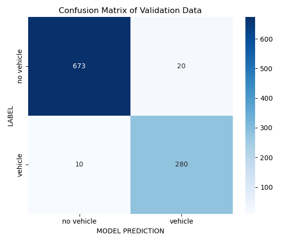
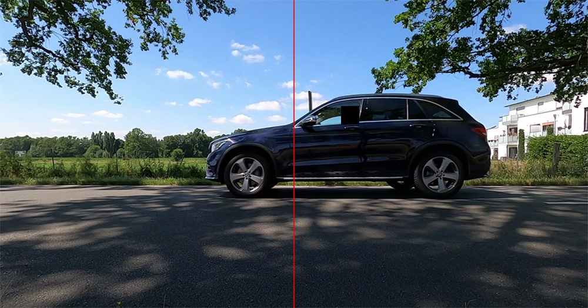

# Acoustic Based Vehicle Counting

This is a tutorial project on how to organize and process acoustic traffic data and then train a neural network on that data (or data that you can add yourself) for a system that counts the number of vehicles passing on a street using a single microphone. The network we will be training is rather small and can easily run on a Raspberry Pi. I also share some thoughts on what's required in order to build a real world system from this. There's also a detailed description on how to improve the current models performance and add your own data to the training process.

You can either 1) just look at the code and try it out for learning purposes or 2) follow the tutorial and add your own data to build a fully functioning vehicle counting device for yourself. This project focuses on the deep learning side of said device. Some of the challenges of building a real world application from this are described at the bottom.

### Why?

I think I should probably write some motivation for this like how monitoring traffic is important to fight noise pollution. Though this is absolutely true my honest motivation for this project was just me being curious on how many cars are actually passing by my own house each day. But noise pollution is definitely a thing and it affects me especially as someone who loves to record audio in quiet nature ambiences. THOSE DAMN AIRPLANES GNARR !!

### Why use a microphone?

Compared to other sensors that would be useful for this task like cameras microphones are cheap, small, use less power, and their data is easier to handle. Recording sound also raises less privacy concerns than video.

### How do I get this running?

The main script is `generate_chunks_and_train_model.py`. It will process the given example data that comes with this project inside `./recordings/` and train a small neural network on it. More information below. Im still missing a `requirements.txt` so you need to install things manually. `CUDA` is not required but if set up correctly this script will utilize it. Otherwise training will be on CPU and rather slow. You also need `ffmpeg` for `torch`. I used PyTorch `2.4.0+cu124`.

I included `example_console_output.txt` for you to check on what you should expect when executing the script successfully. Note that you might get different metrics at the end since you will have a different random seed.

After the training is done the model will be exported as `trained_model.pth` as well as the `confusion_matrix.png` with the stats of the model performance (both files already exist bot will be overwritten).

Read more below for a deeper explanation of things.

# Data

In order to train a model that is up to the task we need data. The best data for training is the one that is closest to what the actual data will look like for your real world application. When you train a model using data from a dry road it might fail with wet conditions. 

This project includes an example recording `1.wav` of mine so that you can get going and understand the rest of the workflow. Though the model performs well even on this short clip the model wont perform well in the real world (which i still have to test).

### How was the example data recorded?

The example recording is about 10 minutes long and features exactly 100 vehicle passing events. The recording was made on a two lane road with one lane for each direction. I set up my Zoom F6 recorder with a RODE NTG5 microphone with its dedicated dead-cat wind protector on the side of the road with a distance of about one meter and approximately 0.5 meters above the ground. The microphone was pointed in a 90 degree angle towards the road. The recording is situated in `./recordings/1.wav`. The samplerate is 48 kHz and its a 24 Bit linearPCM format. The fader on the recorder was set to +0dB.

### I dont have this fancy expensive audio recording gear. What can I do?

No problem at all. I used this gear for research. Others use cheap MEMS microphones (3$) and got good results and I will end up using them for my final vehicle counting device in the future. Theres no way i will be putting out a big and expensive microphone constantly on my windowsill.

### Labels

In order for the model to learn from that data we need to have labels. Theres a difference between strong labels (exact timestamps of passing events for each recording) and weak labels (just how many passing events are in each recording). Though a working model could be build with weak labels too strong labels are much more promising. However it takes a lot more time to create them. This project uses strong labels and its the real challenge of this application (creating enough and realistic data with strong labels requires a lot of effort).

The timestamps are stored in `labels.csv`. This table has two columns. The first column is `timestamp` which contains the timestamp of a passing event in seconds and the other column is `location` which corresponds with the filename of the recording file. This is important. The code will link this field with the actual file.

### How does the code work?

We now understand what kind of data and labels are required for the model to learn from. But how does the model learn from them? 

Each recording in `./recordings/` will be chunked into (by default) two second long chunks. This is done with `generate_chunks.py`. The chunks will be stored in a folder called `./chunks/` that will be created. The chunks will be stored in `.wav` files called `0.wav`, `1.wav`, `2.wav` and so on. Every time you call `generate_chunks()` new chunks will be added to that folder. If you want to start over you can just delete the folder `./chunks/`. 

A new dataframe `chunk_labels.csv` will also be created in this folder that contains information about every chunk so you can keep track of them. It features the columns `chunk_idx` which corresponds with the filename of the chunk, `rec` which corresponds with the filename of the recording the chunk comes from, `start_t` and `end_t` which tell the timestamps of the start and end of the chunk inside the original recording, `pass_event` which is `0` when the chunk does not contain any passing vehicles and `1` if it contains at least one pass event. The last fields `aug_file` and `aug_volume` are described later.

Why do we chunk the data? This is a common procedure in Sound Event Detection (SED). The neural network will learn to process one chunk at a time and predict if it contains a vehicle passing or not. Of course this comes with its challenges. For example when two vehicles pass inside the same chunk (they will be counted as only one). The model in this project also doesn't use the raw audio of the chunks. The code will calculate a spectrogram visualization (more precise the mel spectrogram) of the audio with the size of 80x80 pixels and this will be the input for the model. So we basically create an image classifier. This is common practice in the field of SED.

More data is always better. We can essentially double the amount of chunks by chunking the recordings again. But this time with an offset of one second. The new chunks dont contain any new information but will look different to the ones that we already have. For example if a vehicle passing is situated right at the end of a chunk it will now be featured in a second chunk but this time almost centered. We do this by calling `generate_chunks()` again with an `init_offset = 1`.

### Data Augmentation

We already doubled our data with different chunking methods. We can have even more data if we use data augmentation. This is the process of altering our existing data and adding it to the pool to make our model more robust. For example we could add some noise to some chunks. Though this process will result in a more reliant model you might want to skip it in the beginning if this is all new to you. Having good data will be much more important.

This implementation uses audio files in the folder `./augmentation/` (also `.wav` 48 kHz) to add random segments from them to our chunks. I provide you with a file `storm.wav` I recorded. This recording is 30 seconds long. You can add more files that represent realistic background noises to your location. 

Calling `generate_chunks()` again but this time with `data_augmentation = True` the code will generate every chunk again but now every time a chunk is generated a random two second long segment of a random audio file from `./augmentation/` will be added to the audio to simulate background noise. We call `generate_chunks()` a last time again with data augmentation but this time also with the initial offset.

The column `aug_file` in `chunk_labels.csv` will then tell what audio file was used for augmentation. `aug_volume` is always `1` by default. You can alter this in the code or even use a random value. This is a factor of how dominant the background audio will be. `1` means its full volume. The value is also stored in the new dataframe.

### Data Loaders, Model Architecure and Training

After chunking the script `generate_chunks_and_train_model.py` will create DataLoaders and implement the models architecure. The model will then be trained for a couple of epochs.

The way these bits are designed is pretty much standard PyTorch stuff for convolutional neural networks. I chose a model architecture with three convolutional blocks and three fully connected layers afterwards. I also use BatchNorm2d and MaxPool2d. This it not the place to explain all of this. I recommend copying sections of the model or the training function you dont understand to ChatGPT and asking it to explain them. 

For training I used the CrossEntropyLoss and an AdamW optimizer with weight decay. I also use a scheduler to reduce the learning rate if necessary to optimize the loss function even more. The code will use CUDA if set up correctly and then automatically train on your GPU. Otherwise it will be the CPU. I used only 20 epochs and an initial learning rate of 0.001 which already gave good results.

During training there will be a console output of the training statistics after each epoch. `accuracy` is often used to evaluate the model performance. Since we have a lot more chunks containing no vehicles passing than otherwise `accuracy` is not a good metric. For data with class imbalance like this `recall` and `precision` are much more important. Make sure you understand what those values mean. This is crucial. 

After the training is done the confusion matrix will be shown. This also very important. Currently the model will be evaluated on 40% of the data while being trained the other 60%. The confusion matrix only contains the results of the 40%.

# How do I make this work for my own system?

### Add your own data

If you are serious about this you will need to add more data. Not just any data. You need to add multiple recordings with different conditions that are realistic for your desired location. If you are in a desert you probably dont need a recording of vehicles in snowy conditions. If you have times with high density traffic you would need a recording of that. If you also have times with low traffic density make a recording of that as well. The distribution of real world conditions and recordings should be somewhat equal.

You could also build something that records ten minutes of footage each hour during one representative day.

Your recordings should also be made with the microphone you would end up using for the final device (not like me). It should use the same samplerate of 48 kHz and be a `.wav` file or you would otherwise need to adjust the code. Theres no constraint on how long the recordings should be since we are chunking them anyway. 

Put your recordings into the `./recordings/` folder. Besides the actual recordings you need to add the labels. Append the timestamps of the passing events to `labels.csv`. Make sure to put the name of the recording file into the column `recording` of this `.csv` file because this field and the actual filename of the recording will be linked later.

### Add the corresponding timestamps

One way to annotate your data for training and testing would be to temporarily use a camera with your setup pointed in a 90 degree angle to the road just like the microphone. Then you can use almost every video editing software to synchronize video and audio (you could even add the audio of your camera to the data pool for more variety). Then draw a center line and set a marker each time a vehicle crosses this center line (I personally used the timestamp of the first video frame where the car is behind the center line). Then transfer the timestamps to  `labels.csv` and add the correct name of the recording.

**NOTE:** You should respect local laws and restrictions when it comes to recording video in public. At this point I should probably mention that even recording audio in public might be something that could be prohibited where you live. So please do your homework.

# Improve the performance even more by experimenting

Adding your own data with a realistic variety and correct labels is the best way to improve the models performance in the real world. Besides that there are plenty of parameters you can try to tune. Here are some hints:

* after adding more data, set `validation_size = 0.2` 
* train for more epochs (i.e. 50 epochs)
* try different chunking methods like overlaps, shorter or longer chunks
* try to adjust the parameters of the mel spectogram representation (`n_mels`, `n_frames`, `n_fft`)
* add more data augmentation tactics like random volumes of overlayed audio files and add different kinds of noise
* adjust the model architecture (number of layers, filter sizes, ...)

# Challenges of a Real World System

As said above this project focuses on the deep learning side. In order to build a fully functioning system from this you would need to address some other challenges as well. Here are some thoughts.

For example you would need a device that continuously records and processes the audio (I tested a Raspberry Pi 3B which was easily capable of doing this). One thread would need to record two second long chunks continuously while a parallel thread would need to run the model on every chunk. With two second long chunks this means that the device needs to calculate the spectrogram representation, put it through the model, and save the results in some kind of database in under two seconds reliably. Also building some kind of dashboard would be nice. If you put this thing outside in the real world you would also need to monitor if a data drift occurs. That means that the real world audio that your system then records does no longer match your training data well enough (i.e. spontaneous construction work in front of your system). If you do not take care of this your results may loose in quality and get wrong over time. 

# You want to know even more?

Here are some interesting papers:

Sound Event Detection: A tutorial
https://ieeexplore.ieee.org/abstract/document/9524590

IDMT-Traffic: An Open Benchmark Dataset for Acoustic Traffic Monitoring Research
https://ieeexplore.ieee.org/abstract/document/9616080

Mel-spectrogram features for acoustic vehicle detection and speed estimation
https://ieeexplore.ieee.org/abstract/document/9743540

Neural network-based acoustic vehicle counting
https://ieeexplore.ieee.org/abstract/document/9615925

Robust Audio-Based Vehicle Counting in Low-to-Moderate Traffic Flow
https://ieeexplore.ieee.org/abstract/document/9304600

Acoustic Vehicle Speed Estimation From Single Sensor Measurements
https://ieeexplore.ieee.org/abstract/document/9528379
